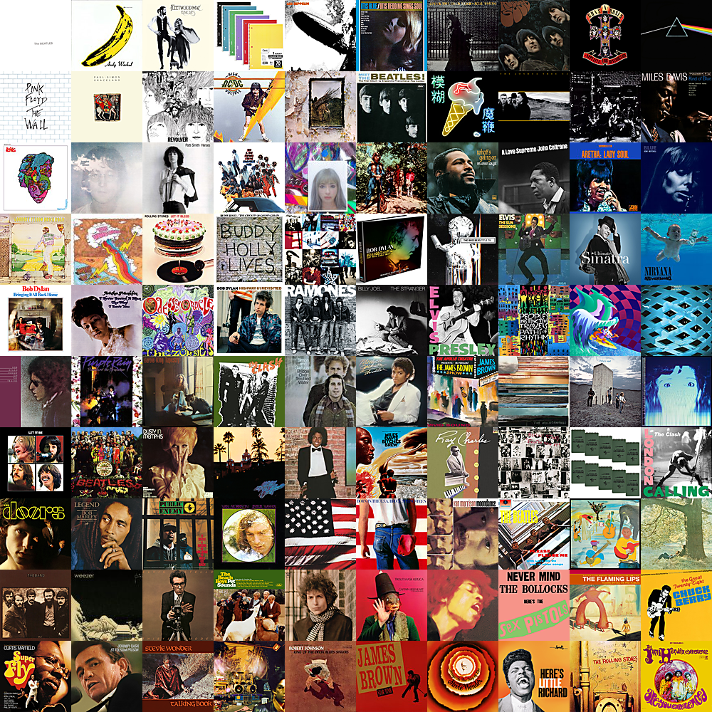
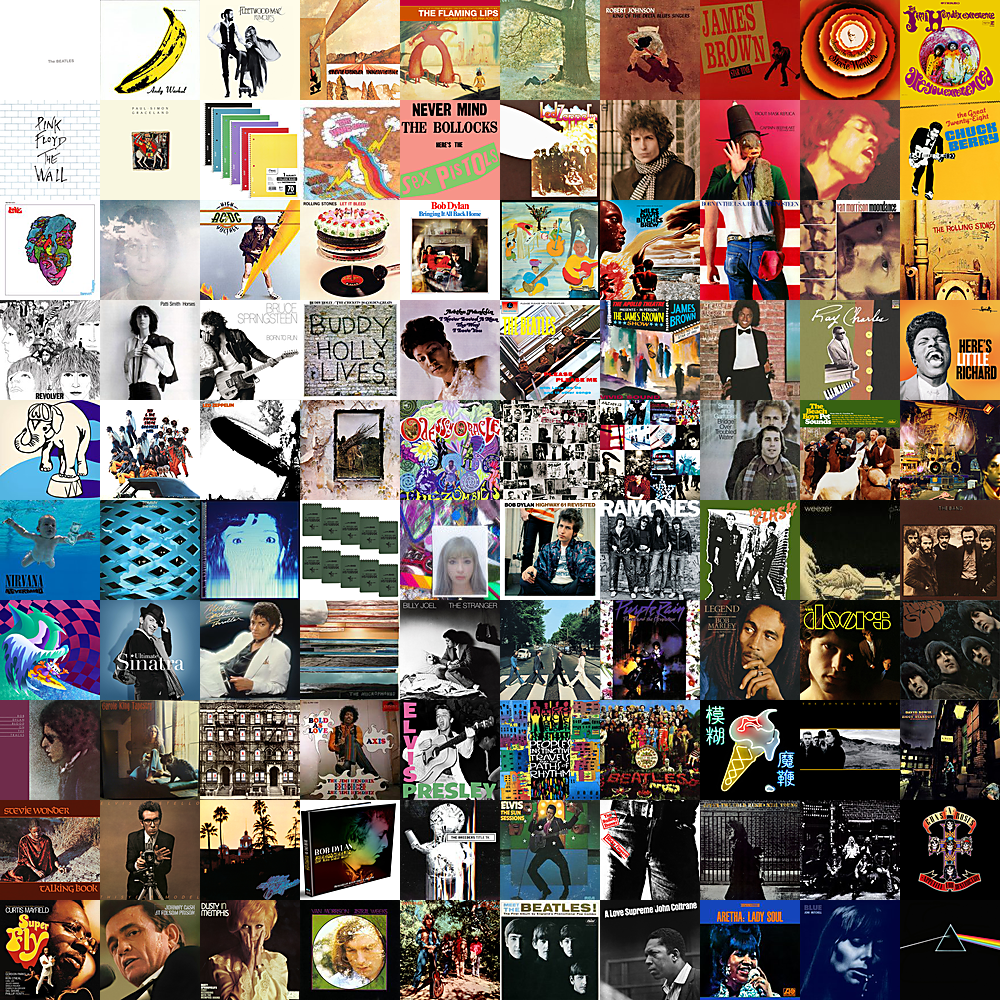
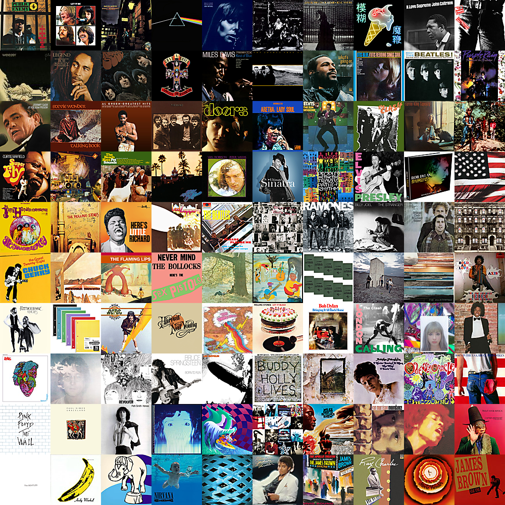
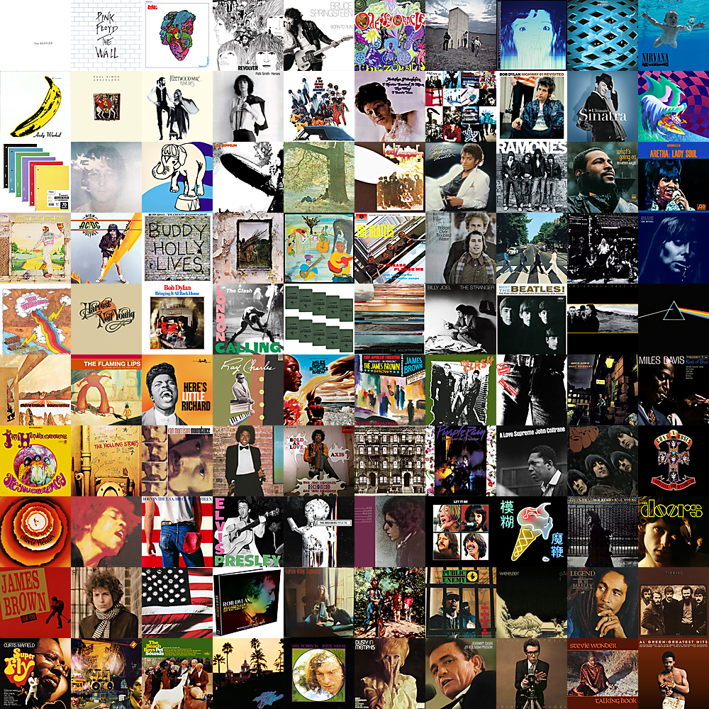

# Gradient Mosaic Generator

### Motivation

Once upon a time, a group of around ~40 square, ceramic album art coasters were crafted as part of a weekend arts-and-crafts project. After all the coasters had been properly assembled, glued, and dried, they were laid out on a coffee table in a contemporary living room both for the aesthetics of the moment and for an obligatory *à la mode* photoshoot. It was soon realized that tiling the coasters randomly on the coffee table resulted in suboptimal aesthetics. *Was there a better way to lay the coasters out on the table?* 

Having endured frightening amounts of exposure to leetcode problems, my brain reactively, and against my free will, context-switched into a state of problem-solving automation. It was agreed upon that the most optimal tile layout would be one such that each tile appears to blend into the next. 

In simple terms, an ideal layout would most closely approximate a gradient. This definition can have several different interpretations, each with their own specification of what entails an *optimal* mosaic. 

Since encountering this larger-than-life problem, I haven't been able to kick the urge to try and code up some of the proposed solutions. This repository contains a few different algorithms and approaches on how to generate an optimal "gradient mosaic".

### The Problem

Given a set of square image tiles of the same width, the desired output is a tiled photo mosaic such that each photo appears to blend into its neighbors (i.e. a color gradient).

### Algorithm 1: Breadth-First Greedy
- Calculate the average color of each tile
- Place a seed tile at (0,0)
- For each blank tile in a breadth-first order, starting at (0,0):
	- Place the candidate tile with the minimum sum of RGB differences between it's nearest neighbors
- Rank the mosaic based on the sum of RGB differences between all pairs of adjacent tiles (sum weights in the graph)

#### Sample Algorithm 1 results:

### Algorithm 2: Random Swap
- Start with a random configuration of tiles on a canvas
- Calculate the sum of RGB differences between all pairs of adjacent tiles (sum weights in the graph)
  - Call this sum the `delta_sum`
- While true:
	- Swap two random tiles and update the `delta_sum` (done in constant time)
	- If the new `delta_sum` is lower than the old `delta_sum`, continue the loop (save the changes)
	- Else, reverse the changes by swapping again
	- If `TIMEOUT` iterations have passed without a successful swap, exit the loop

#### Sample Algorithm 2 results:

