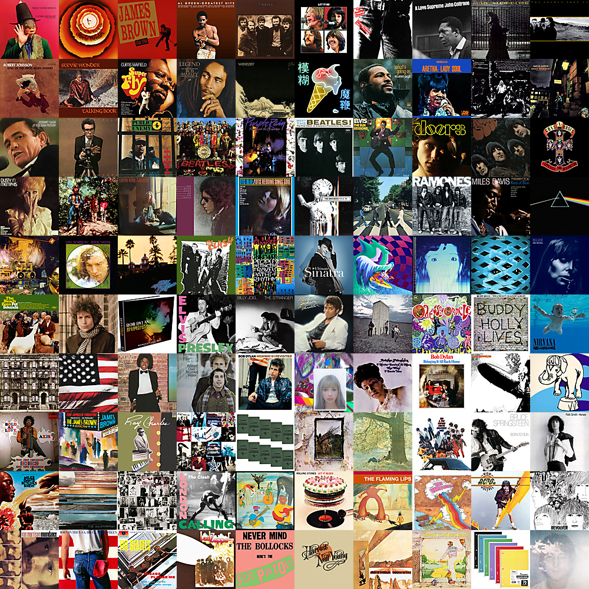
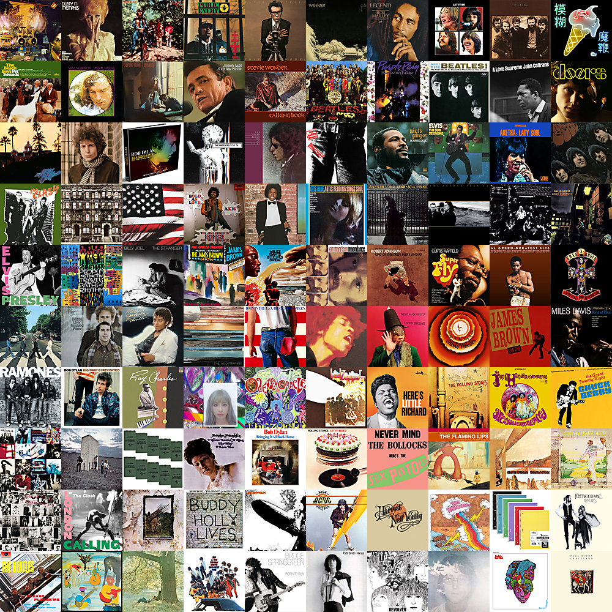
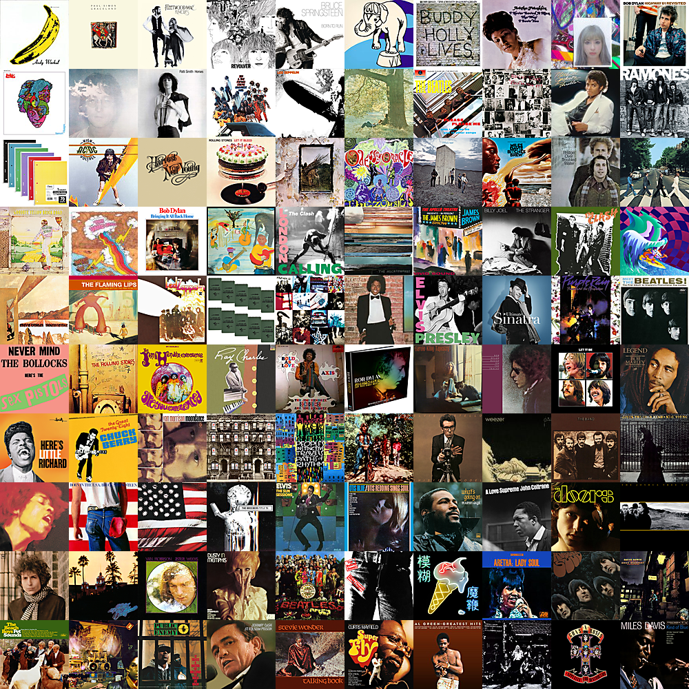
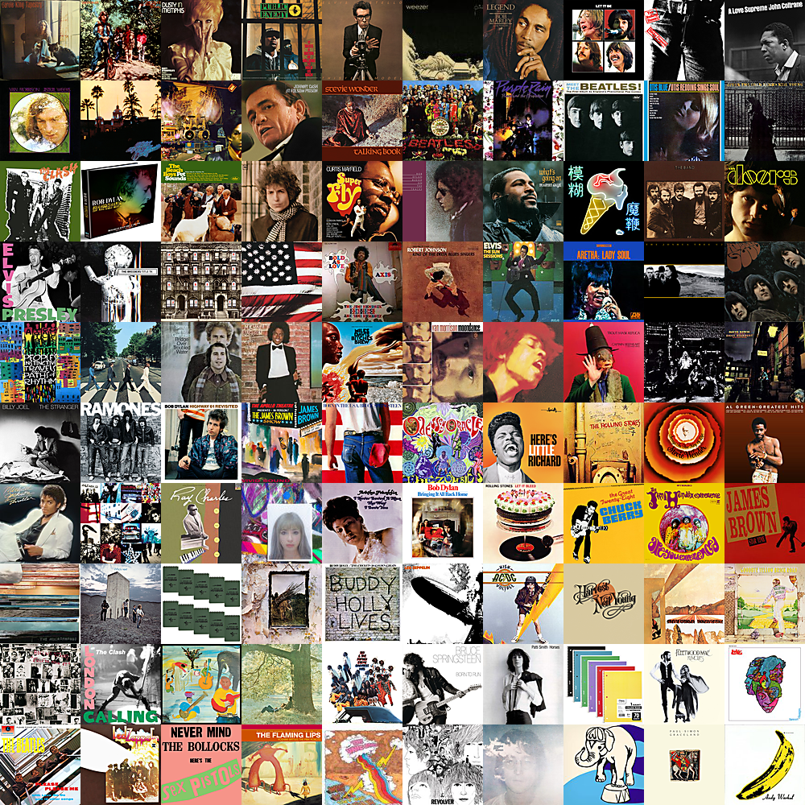
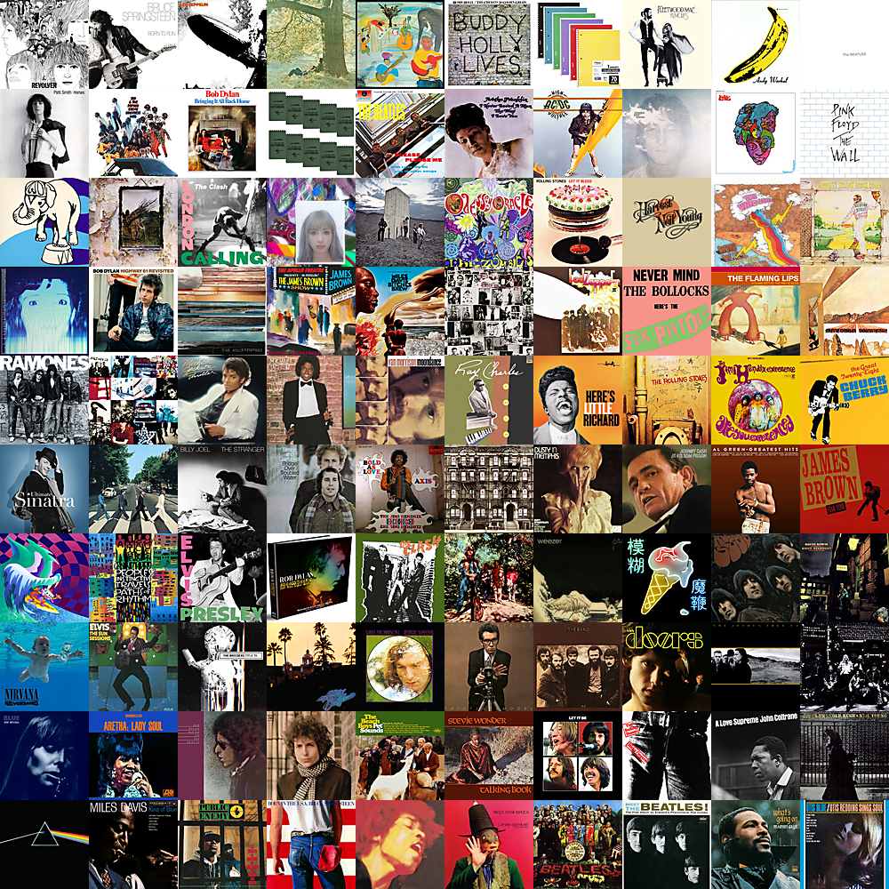
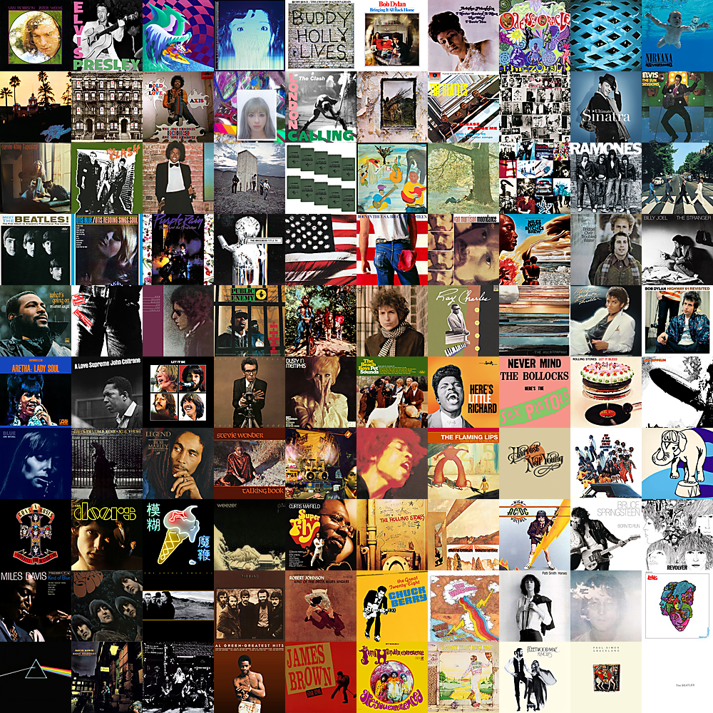
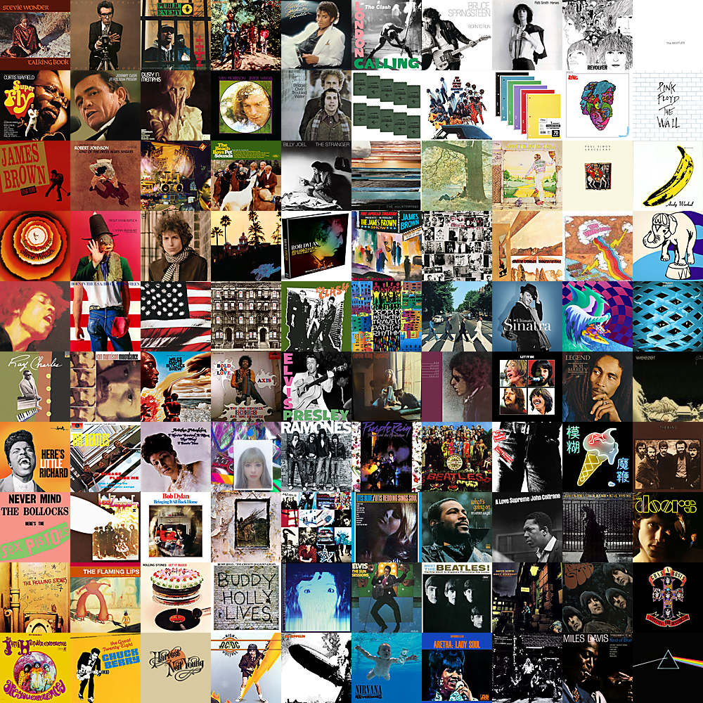
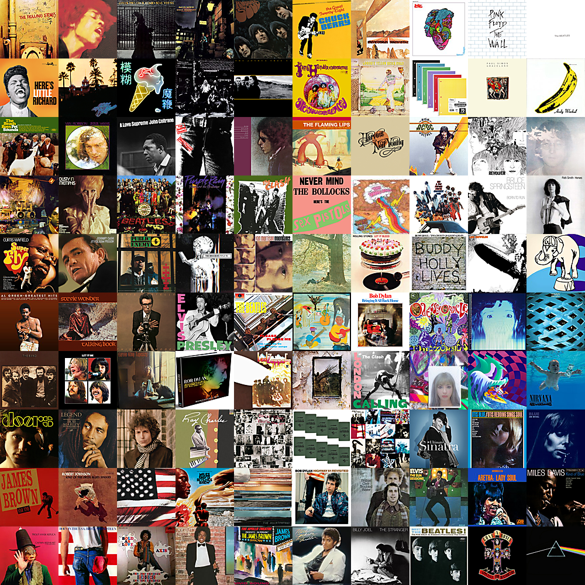

# Gradient Mosaic Generator

### Problem

Given a set of square image tiles of the same width, the desired output is a tiled photo mosaic such that each photo appears to blend into its neighbors (i.e. a color gradient).

### Algorithm 1: Breadth-First Greedy
- Calculate the average color of each tile
- Place a seed tile at (0,0)
- For each blank tile in a breadth-first order, starting at (0,0):
	- Place the candidate tile with the minimum sum of RGB differences between it's nearest neighbors
- Rank the mosaic based on the sum of RGB differences between all pairs of adjacent tiles (sum weights in the graph)

#### Sample Algorithm 1 results:

### Algorithm 2: Random Swap
- Start with a random configuration of tiles on a canvas
- Calculate the sum of RGB differences between all pairs of adjacent tiles (sum weights in the graph)
  - Call this sum the `delta_sum`
- While true:
	- Swap two random tiles and update the `delta_sum` in (constant time)
	- If the new `delta_sum` is lower than the old `delta_sum`, continue the loop (save the changes)
	- Else, reverse the changes by swapping again
	- If `TIMEOUT` iterations have passed without a successful swap, exit the loop

#### Sample Algorithm 2 results:

