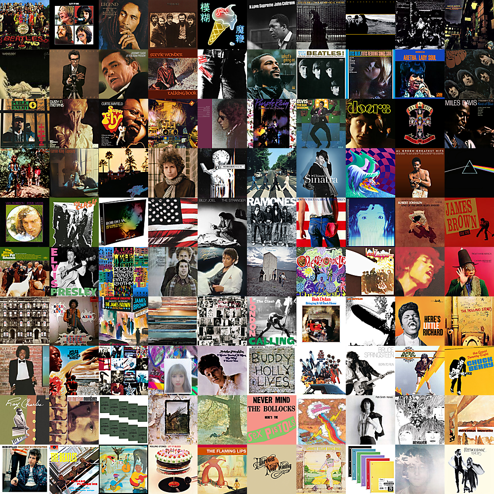

# Gradient Mosaic Generator

Given a set of square image tiles of the same width, the desired output is a tiled photo mosaic such that each photo appears to blend into its neighbors (i.e. a color gradient).

### Algorithm 1: Breadth-First Greedy
- Calculate the average color of each tile
- For each possible seed tile
  - Place the seed tile at (0,0)
  - For each blank tile in a depth-first order, starting at (0,0):
    - Place the candidate tile with the minimum sum of RGB differences between it's nearest neighbors
    - Rank the mosaic based on the sum of RGB differences between all pairs of adjacent tiles (sum weights in the graph)
  - Insert resulting mosaic into a heap
- Output the top ten mosaics by popping from the heap

#### Sample Algorithm 1 results:

