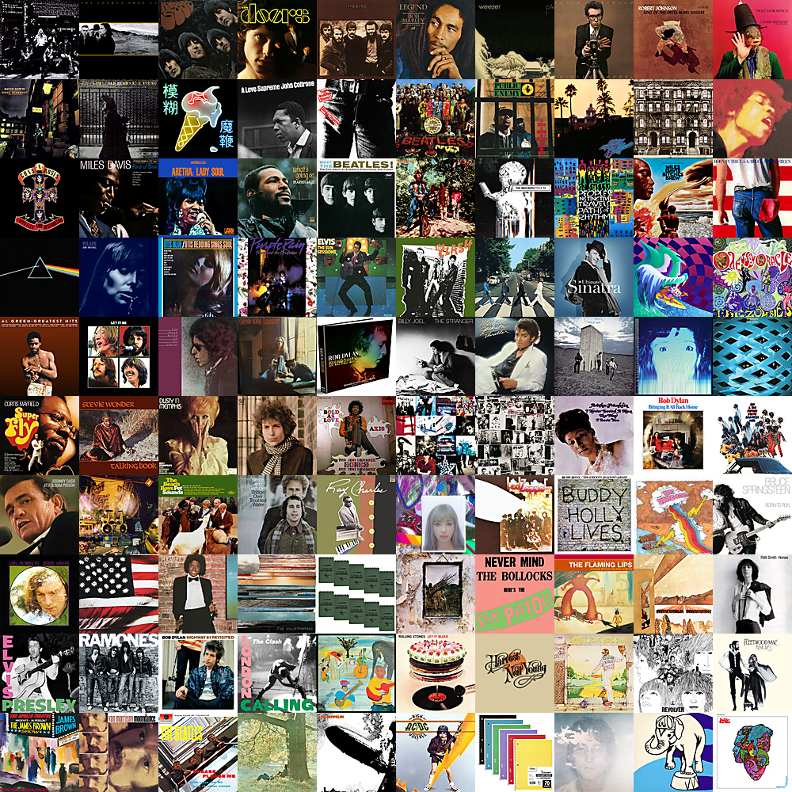

# Gradient Mosaic Generator

Given a set of square image tiles of the same width, the desired output is a tiled photo mosaic such that each photo appears to blend into its neighbors (i.e. a color gradient).

### Algorithm 1: Bottom-up picking of tiles with minimum difference in average RGB values

- Calculate the average color of each tile
- For each possible seed tile
  - Place the seed tile at (0,0)
  - For each blank tile:
    - Place the candidate tile with the minimum sum of RGB differences between it's left, upper, and upper-left neighbors
    - Rank the mosaic based on the sum of RGB differences between all pairs of adjacent tiles (sum weights in the graph)
    - Insert mosaic into a heap
- Output the top ten mosaics by popping from the heap

#### Sample Algorithm 1 results:

